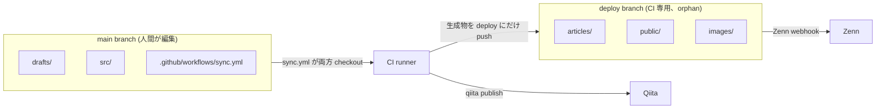

# SyncLore

GitHub を Single Source of Truth として、`drafts/` に書いた Markdown を
**Zenn・Qiita の両方に自動公開**する一元管理リポジトリ。

`drafts/<slug>.md` の `publish: true` で `main` に push するだけで反映。
`publish: false` に戻して push すれば両方とも非公開状態に書き戻されます。

---

## ブランチ構成



- **main**: 人間が触る場所。`drafts/`・`src/`・`.github/`・`README.md`・`package.json` だけが置かれる。
- **deploy**: CI が生成した `articles/`・`public/`・`images/` だけが置かれる orphan branch。Zenn の GitHub 連携はこの branch を watch する。手で触らない (`.gitignore` で main 側の working tree から除外済み)。

```text
main:                              deploy:
  drafts/                            articles/
    template.md                        my-article.md
    my-article.md                    public/
    images/my-article/                 my-article.md   (Qiita id 保管)
      figure1.png                    images/
  src/                                 my-article/
    convert.js                           figure1.png
    synclore-delete.js
  .github/workflows/sync.yml
```

> Qiita の記事 id は `public/<slug>.md` の `id` フィールドに保管され、qiita-cli が
> 公開時に自動で書き戻します。

---

## How to Use

### 1. 新しい記事を書く

`drafts/template.md` をコピーしてスラグ名を決めます。

```
drafts/my-new-article.md
```

フロントマター:

```yaml
---
title: "記事タイトル"
emoji: "✨"              # Zenn 専用 (省略時は 📝)
type: "tech"             # tech | idea (Zenn 専用)
topics: ["julia", "oss"] # タグ。Zenn は最大 5 個
publish: false           # 下書き中は false
---
```

### 2. 公開する

`publish: true` に変更して `main` ブランチへ push。

```
git add drafts/my-new-article.md
git commit -m "Add: my-new-article"
git push
```

GitHub Actions (`sync.yml`) が以下を **1 本の workflow で atomic に** 実行します:

| ステップ      | 内容                                                                                                          |
| ------------- | ------------------------------------------------------------------------------------------------------------- |
| checkout      | main (sources) と deploy (artifacts) を `.deploy/` にデュアル checkout                                         |
| convert       | `drafts/*.md` を `.deploy/articles/`・`.deploy/public/`・`.deploy/images/` に冪等再生成                       |
| qiita publish | `.deploy/` で `npx qiita publish --all` 実行 / 新規時は `public/<slug>.md` に id を書き戻し                    |
| PR + merge    | deploy branch に CI sync PR を作って auto-merge                                                                |
| Zenn          | GitHub 連携 webhook が deploy の commit を検知して反映                                                         |

Qiita publish が失敗したときは PR 自体が作られないため、Zenn 側だけ進む / Qiita id がズレるといった半端な状態になりません。失敗時は workflow を re-run。

### 3. 非公開に戻す (unpublish)

`publish: false` に戻して push すると:

- `articles/<slug>.md` → `published: false` (Zenn 側で draft 扱い)
- `public/<slug>.md` → `private: true` (Qiita 側で限定共有 = 非公開)

`drafts/<slug>.md` は削除されません。再公開したい場合は `publish: true` に戻すだけ。

### 4. 記事を修正する

`drafts/<slug>.md` を編集して push するだけ。`articles/`・`public/` は毎回再生成されるので、Qiita の id は維持されたまま本文だけ更新されます。免責事項は HTML コメントマーカで囲まれているため、再生成しても重複しません。

### 5. 完全に削除する (delete)

`drafts/<slug>.md` のフロントマターに `delete: true` を追加して push:

```yaml
---
title: "..."
publish: false
delete: true   # ★ 不可逆: Qiita 側は API DELETE
---
```

- **Qiita**: API DELETE で投稿そのものを完全削除
- **Zenn**: `articles/<slug>.md` を repo から削除 → Zenn UI から非表示。ただし Zenn サーバ側のデータは残るため、完全消去したい場合は Zenn 管理画面でも削除してください
- **Repo**: `articles/<slug>.md`・`public/<slug>.md`・`images/<slug>/` を CI が削除
- `drafts/<slug>.md` は **tombstone として残ります** (`delete: true` のまま)。再公開はできない (Qiita 側が消えているので新規投稿になる) ので、完全に履歴から消したい時は手で `git rm drafts/<slug>.md` してください。

⚠️ Qiita API DELETE は不可逆です。誤って `delete: true` を書かないよう注意。

### 6. 画像を使う

画像は `drafts/images/<slug>/` に置きます。

```
drafts/images/my-new-article/figure1.png
```

CI が `images/<slug>/` にコピーします。記事内では Zenn 形式で参照:

```markdown

```

### 7. ローカルプレビュー

deploy branch を `.deploy/` worktree として展開してから convert すると、main の working tree を汚さずに生成物を確認できます。

```bash
npm install

# deploy branch を .deploy/ に worktree として展開 (初回のみ)
git worktree add .deploy deploy

# drafts/ → .deploy/articles/, .deploy/public/, .deploy/images/ を生成
SYNCLORE_DEPLOY_ROOT=$(pwd)/.deploy npm run convert

# Zenn のプレビューサーバー (.deploy/ から起動するのが楽)
cd .deploy && npm run preview:zenn
```

`SYNCLORE_DEPLOY_ROOT` を指定しない場合は main の working tree (`articles/` 等) に出力されますが、`.gitignore` で除外されているので commit できません — ローカル確認用と割り切ります。

---

## 初期セットアップ (初回のみ)

1. **依存パッケージをインストール**
   ```bash
   npm install
   ```

2. **GitHub Secrets に `QIITA_TOKEN` を登録**
   Settings → Secrets and variables → Actions → New repository secret

3. **Zenn と GitHub リポジトリを連携 (deploy branch を watch)**
   [Zenn のデプロイ設定](https://zenn.dev/dashboard/deploys) でこのリポジトリを連携し、対象 branch を **`deploy`** にする
   (default の `main` ではなく `deploy`。articles は deploy にしか無いので注意)

4. **リポジトリを Public に設定** (GitHub Actions 無料枠のため)

---

## License & Disclaimer

| 対象 | ライセンス |
|------|-----------|
| リポジトリ内のコード・スクリプト | [MIT License](./LICENSE) |
| 記事本文 (執筆物) | All Rights Reserved — 無断転載・再利用を禁じます |

> **免責事項**
> 記事の内容は執筆時点のものであり、正確性・完全性を保証しません。
> 本リポジトリの利用によって生じたいかなる損害についても筆者は責任を負いません。
