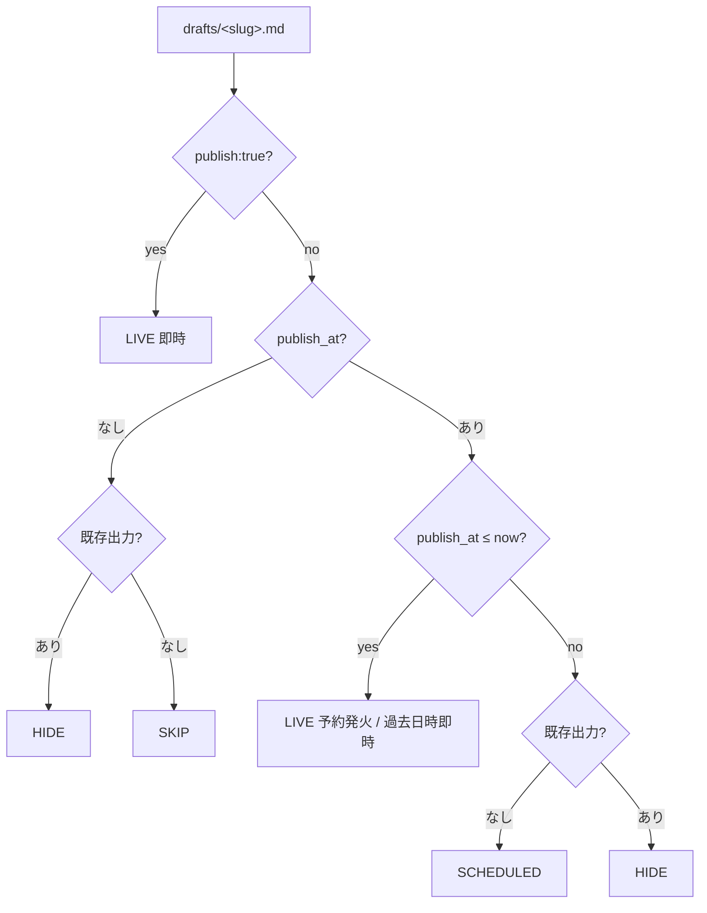

# SyncLore

Markdown 記事を **Zenn と Qiita の両方に自動公開**する一元管理リポジトリ。
`drafts/<slug>.md` を書いて main に push するだけで、両プラットフォームに同じ内容が反映されます。

> 📦 このリポジトリは **GitHub Template Repository** です。「**Use this template**」ボタンから自分用の repo を作って使えます。下の[「自分用に fork して使う」](#自分用に-fork-して使う)を参照。

---

## できること

| 操作        | やり方                                         | 反映先                                       |
| ----------- | ---------------------------------------------- | -------------------------------------------- |
| 公開        | `drafts/<slug>.md` に `publish: true` で push  | Zenn `published:true` / Qiita `private:false` |
| **予約公開** | `publish: false` + `publish_at: "2026-05-01T10:00:00+09:00"` で push | 時刻到来後の毎時 cron で LIVE 化 (Zenn / Qiita ともに) |
| 修正        | `drafts/<slug>.md` を編集して push             | Zenn / Qiita 両方を update (Qiita id 維持)     |
| 取り下げ    | `drafts/<slug>.md` を `publish: false` に戻す  | Zenn `published:false` / Qiita `private:true`  |
| 完全削除    | `drafts/<slug>.md` に `delete: true` を付与    | Qiita API DELETE / Zenn UI から非表示         |
| 画像        | `drafts/images/<slug>/figure1.png` 等に置く    | Zenn 用 `images/<slug>/` へ自動コピー         |

主な特徴:

- **drafts/ が SSoT** — 同じ記事を Qiita と Zenn でコピペ管理する必要なし
- **予約公開** — `publish_at` を ISO-8601 で書いておけば毎時 cron が時刻到来時に自動公開。Zenn-CLI / Qiita-CLI どちらにも無い機能を SyncLore レベルで提供
- **Atomic** — Qiita publish が失敗したら deploy へも push しないので、Zenn と Qiita で公開状態がズレない
- **冪等** — 同じ drafts を何度処理しても結果は同じ。Qiita 記事 id は `public/<slug>.md` に保管され、再変換しても引き継がれる
- **生成物は別 branch (`deploy`)** — 人間の作業領域に articles/ public/ が混ざらない
- **執筆履歴を残す** — `deploy` branch の [`INDEX.md`](../../blob/deploy/INDEX.md) に公開記事一覧が auto-update され、GitHub Releases (release-drafter) には PR ベースで「新規 / 修正 / 取り下げ / 削除」のログが蓄積される

---

## 自分用に fork して使う

このリポジトリは GitHub の **Template Repository** に設定済みです。GitHub 上で「**Use this template**」ボタンから自分用の repo を作るのが推奨ルート (fork でも動きます)。

### 1. 複製

- **推奨**: ページ上部の **"Use this template" → "Create a new repository"**
  → 新しい repo が作られ、`Include all branches` にチェックを入れると `deploy` branch も一緒にコピーされます (★ 入れ忘れ注意)
- もしくは: 通常の "Fork" でも OK (deploy branch も自動でコピーされる)

### 2. ローカルに clone してデモ記事を片付ける

このリポジトリには動作デモ用に [synclore-intro](https://qiita.com/sotashimozono/items/578f207e0ffb4eb7ecf5) という記事が入っています。**そのままだと自分の Qiita / Zenn に他人 (元 repo オーナ) の記事が出る**ため、まず削除します。

```bash
git clone <your-new-repo-url>
cd <your-new-repo>
npm install
git worktree add .deploy deploy   # 生成物 branch を .deploy/ に展開

npm run init:fork                 # デモ記事を drafts/ と .deploy/ から削除

# 確認して commit & push
git add -A && git commit -m "init: remove SyncLore demo article" && git push
cd .deploy && git add -A && git commit -m "init: remove SyncLore demo artifacts" && git push origin deploy && cd ..
```

### 3. Secrets / Variables / Public 化

- **Settings → Secrets and variables → Actions → Secrets**
  - `QIITA_TOKEN` を登録 ([Qiita アプリ設定](https://qiita.com/settings/applications) で `read_qiita` + `write_qiita` のトークンを発行)
- **Settings → Secrets and variables → Actions → Variables** (任意)
  - `QIITA_USERNAME`、`ZENN_USERNAME` を設定すると INDEX.md の URL がそのユーザ名で組まれる (未設定なら GitHub の owner 名)
- **Settings → General → Visibility**: Public に変更 (GitHub Actions 無料枠のため)

### 4. Zenn と連携 (deploy branch を watch)

[Zenn のデプロイ設定](https://zenn.dev/dashboard/deploys) で自分の repo を連携し、対象 branch を **`deploy`** に設定。
(`main` ではなく `deploy` です。articles は deploy branch にしか置かれません)

### 5. 最初の記事を書いて push

```bash
cp drafts/template.md drafts/my-first-post.md
# 編集して publish: true にしてから
git add drafts/my-first-post.md
git commit -m "add: my-first-post"
git push
```

GitHub Actions の `sync.yml` が両プラットフォームに同時公開します。

---

## 使い方

### 記事を書く

`drafts/template.md` をコピーしてスラグ名を決めます。

```yaml
---
title: "記事タイトル"
emoji: "✨"              # Zenn 専用 (省略時は 📝)
type: "tech"             # tech | idea (Zenn 専用)
topics: ["julia", "oss"] # タグ。Zenn は最大 5 個
publish: false           # 下書き中は false
---
```

`publish: true` にして main へ push すると公開されます。

### 予約公開する (scheduled)

未来の日時を指定して push しておけば、その時刻を過ぎた後の cron 実行で自動公開されます。

```yaml
---
title: "..."
publish: false
publish_at: "2026-05-01T10:00:00+09:00"   # ISO-8601 + TZ 必須
---
```

仕組み:

- `sync.yml` は `cron: "0 * * * *"` (毎時 00 分) でも起動
- `convert.js` が `publish_at <= now` の draft を **effective LIVE** として処理 (Zenn `published:true` / Qiita `private:false` で出力)
- 公開後、`drafts/<slug>.md` は `publish: false` のままだが、`publish_at` が過去なので毎回 LIVE 扱い
- 取り下げたい場合は `publish_at` を消す or 未来時刻に戻す

> 粒度: 毎時 00 分の cron + GitHub Actions の遅延 (~15 分) で、最大 1 時間程度のラグ。技術記事には十分。
> Zenn-CLI / Qiita-CLI どちらも公式には予約公開機能を持たないため、SyncLore で実装しています。

#### 予約日時が現在時刻より古い場合の挙動

`publish_at` は「未来」も「過去」も `publish_at <= now → LIVE` という 1 つのルールで扱います。具体的には:

| draft の状態 | 解釈 | Zenn 出力 | Qiita 出力 |
| --- | --- | --- | --- |
| `publish: true` | LIVE 即時 (`publish_at` は無視) | `published: true` | `private: false` |
| `publish: false` + `publish_at <= now` | **LIVE** (予約発火 / 過去日時即時) | `published: true` | `private: false` |
| `publish: false` + `publish_at > now` + 既存出力なし | SCHEDULED (待機) | (出力されない) | (出力されない) |
| `publish: false` + `publish_at > now` + 既存出力あり | HIDE (再公開予約待ち) | `published: false` | `private: true` |
| `publish: false` + `publish_at` なし + 既存出力あり | HIDE (取り下げ) | `published: false` | `private: true` |
| `publish: false` + `publish_at` なし + 既存出力なし | SKIP (執筆中) | (出力されない) | (出力されない) |

含意:

- 予約発火後 (`publish_at` が過去になった後) も `drafts/<slug>.md` を `publish: false` のまま放置 OK。毎時 cron が常に LIVE として再生成するため**公開状態が維持される**。
- 「最初から過去日時を書いて push」しても予約発火と同じ経路で即時公開される。
- 予約を取り下げたい場合は `publish_at` を削除するか未来時刻に書き換える。`publish_at` を残したまま `publish: false` だけ書いても効果がない (過去日時はずっと LIVE 扱い)。
- `publish_at` のパースに失敗した値 (TZ 抜きや不正形式) は「`publish_at` なし」と同じ扱い。**TZ 必須**。



### 修正する

`drafts/<slug>.md` を編集して push するだけ。記事 ID は維持されたまま両方が update されます。免責事項は HTML コメントマーカで囲まれているので再生成しても重複しません。

### 取り下げる (unpublish)

`publish: false` に戻して push:

- `articles/<slug>.md` → `published: false` (Zenn で draft 扱い)
- `public/<slug>.md` → `private: true` (Qiita で限定共有 = 非公開)

再公開は `publish: true` に戻すだけ。

### 完全に削除する (delete)

`drafts/<slug>.md` のフロントマターに `delete: true` を追加して push:

```yaml
---
title: "..."
publish: false
delete: true   # ★ 不可逆: Qiita 側は API DELETE
---
```

- **Qiita**: API DELETE で完全削除
- **Zenn**: `articles/<slug>.md` を repo から削除 → UI から非表示 (Zenn サーバ側データは残るため、完全消去したい場合は Zenn 管理画面で手動削除)
- **Repo**: `articles/<slug>.md`・`public/<slug>.md`・`images/<slug>/` を CI が削除
- `drafts/<slug>.md` は tombstone として残る (履歴からも消したい場合は `git rm` してください)

> ⚠️ Qiita API DELETE は不可逆です。誤って `delete: true` を書かないよう注意。

### 公開済み記事を archive する

公開した記事を「もう触らない、けど Qiita / Zenn では公開状態のまま残しておく」状態にしたいときは、`drafts/<slug>.md` を `drafts/archive/<slug>.md` に move します。

```bash
git mv drafts/foo.md drafts/archive/foo.md
git commit -m "archive: foo"
git push
```

CI は `drafts/` 直下のみ走査するため、`drafts/archive/` 配下のファイルは

- 変換されない (`articles/<slug>.md`・`public/<slug>.md` は最後の状態で凍結)
- INDEX.md にも出ない
- 編集しても push 時に何も起きない (Qiita / Zenn が誤って update されない)

archive から戻すには `git mv drafts/archive/foo.md drafts/foo.md`。Qiita id は `public/foo.md` に保管されたままなので、戻して push すれば PATCH で update されます。

### 記事間リンク (`[[slug]]`)

`drafts/<slug>.md` の本文中で他の記事を参照する際は、Obsidian 風の wiki-link が使えます。

```markdown
詳しくは [[synclore-intro]] を参照。
[[synclore-intro|記事の投稿を自動化するツール SyncLore]] の続編です。
```

公開時に各プラットフォーム向けの URL に自動変換されます:

- Zenn 出力: `[表示テキスト](https://zenn.dev/<user>/articles/<slug>)`
- Qiita 出力: `[表示テキスト](https://qiita.com/<user>/items/<id>)` (id は `public/<slug>.md` から取得)

ターゲット記事がまだ Qiita 公開されていない (id 未割当) 場合、Qiita 出力では GitHub repo の `drafts/<slug>.md` にフォールバックリンクされます。コードブロック内の `[[...]]` は変換されません。表示テキストを省略すると target draft の `title` が使われます。

archive 配下 (`drafts/archive/<slug>.md`) の記事も link target として有効です。記事は `articles/`・`public/` に残ったまま凍結されているため、`[[archived-slug]]` は通常通り公開 URL に解決されます。

### 記事を rename する (aliases:)

`drafts/foo.md` を `drafts/foo-v2.md` に rename したいとき、Qiita id が引き継げないと**新規投稿として重複**してしまいます。これを避けるには新ファイルのフロントマターで旧 slug を宣言します。

```yaml
---
title: "..."
publish: true
aliases: ["foo"]   # ← 旧 slug
---
```

`convert.js` の動作:

- 他記事の `[[foo]]` は `foo-v2` の URL に解決される (alias 逆引き)
- `public/foo.md` に id があれば `public/foo-v2.md` に id を migrate
- 旧 `articles/foo.md` と `public/foo.md` は CI が削除 (orphan 防止)

これで Qiita 側は同じ id のまま update され (URL は id ベースなので変わらない)、wiki-link も切れません。

> ⚠️ Zenn の URL は slug ベースのため、rename すると `https://zenn.dev/.../articles/foo` は 404 になり、`/articles/foo-v2` が新 URL になります。これは Zenn 側の制約で SyncLore では救えません。
> ⚠️ `drafts/images/<slug>/` は自動 migrate されません。必要なら `git mv` で手動移動を。

### 画像を使う

`drafts/images/<slug>/figure1.png` に置けば、CI が `images/<slug>/` にコピーします。記事内では Zenn 形式で参照:

```markdown

```

### ローカルプレビュー

```bash
npm install
git worktree add .deploy deploy                       # 初回のみ
SYNCLORE_DEPLOY_ROOT=$(pwd)/.deploy npm run convert   # 変換
cd .deploy && npm run preview:zenn                    # Zenn プレビュー
cd .deploy && npm run preview:qiita                   # Qiita プレビュー
```

`SYNCLORE_DEPLOY_ROOT` を未指定にすると main の working tree に生成されますが `.gitignore` で commit できないので、ローカル確認用です。

### Branch 命名規約 (release-drafter autolabeler 用)

PR を作るときの branch 名を以下に揃えると、release-drafter が自動でラベルを付け、リリースノートのカテゴリに振り分けてくれます。

| Branch prefix | ラベル | Releases のカテゴリ |
| --- | --- | --- |
| `add/<slug>` | `article-new` | 📝 New articles |
| `edit/<slug>` | `article-update` | ✏️ Updated articles |
| `unpub/<slug>` | `article-unpublish` | 🚪 Unpublished |
| `delete/<slug>` | `article-delete` | 🗑 Deleted articles |
| `chore/...` / `fix/...` / `feat/...` / `refactor/...` / `hotfix/...` | (それぞれ) | 🔧 Maintenance |

PR タイトルの prefix (`add: ...`, `edit: ...` 等) でも同じ判定が走ります。

main へ直 push する場合はラベルが付かないので、Releases に履歴として残したいときは PR 経由を推奨。

---

## アーキテクチャ

```mermaid
flowchart LR
    subgraph main["main branch (人間)"]
        D[drafts/]
        S[src/convert.js<br/>src/synclore-delete.js]
        WF[.github/workflows/sync.yml]
    end
    subgraph deploy["deploy branch (CI 専用、orphan)"]
        A[articles/]
        P[public/<br/>id 保管]
        I[images/]
    end
    main -->|sync.yml が両方 checkout| CI[CI runner]
    CI -->|qiita publish --all| Qiita[Qiita]
    CI -->|生成物を直 push<br/>(gh-pages 同等)| deploy
    deploy -->|webhook 検知| Zenn[Zenn]
```

deploy branch は **gh-pages 風の dump branch** として扱います。CI が直 push するのみで、PR 通知は出ません。Zenn の連携は deploy branch を見ます。Qiita は API push なので branch 構成と無関係。

`articles/`・`public/`・`images/` は main の `.gitignore` でハードブロックされているので、ローカルで誤って commit する事故は起きません。

---

## License

| 対象                                | ライセンス                                                          |
| ----------------------------------- | ------------------------------------------------------------------- |
| リポジトリ内のコード・スクリプト    | [MIT License](./LICENSE)                                            |
| 記事本文 (執筆物)                   | 各記事の著者に帰属 (このリポジトリの記事は All Rights Reserved)     |

> **免責事項**
> 記事の内容は執筆時点のものであり、正確性・完全性を保証しません。
> 本リポジトリの利用によって生じたいかなる損害についても筆者は責任を負いません。
