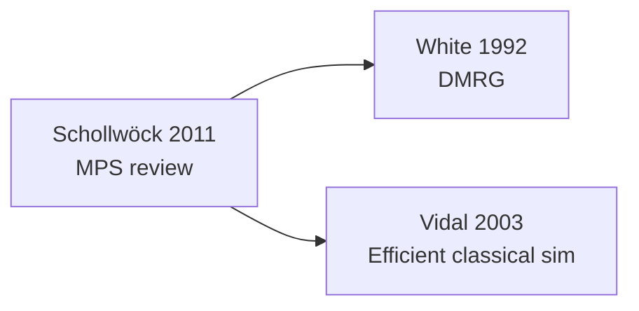

## はじめに

レビュー論文を 1 本見つけたとき、「この paper が引いている文献も全部手元に欲しい」と思うことが頻繁にあります。1 本ずつ DOI をコピペして取るのは現実的でなく、Connected Papers のようなビジュアル系サービスは PDF を実際にダウンロードしてくれません。

[BiblioFetch.jl](https://github.com/sotashimozono/BiblioFetch.jl) には **citation graph 自動展開** があります。seed 論文の DOI を 1 つ与えると、引用文献を Crossref と Semantic Scholar から取得し、それぞれの PDF も同じバッチで回収して、subgraph を git 管理可能な形で残します。

## どう動くか

1 hop 展開の流れ：

```
[seed paper]
    ↓ Crossref で reference list 取得
    ↓ Semantic Scholar で reference list を補完
[seed の引用文献 N 本]
    ↓ 各 DOI を fetch_paper! で並列 fetch
[N 本の PDF + メタデータ]
    ↓ referenced_by フィールドで親子関係を記録
[citation subgraph]
```

各ステップで取れた DOI / arXiv id は store の `.metadata/<safekey>.toml` に **`referenced_dois`** と **`referenced_by`** として残るので、後から再構築可能です。

## 実例：Schollwöck の MPS/DMRG レビュー

`examples/citation-graph-job.toml`：

```toml
[folder]
target = "graph_papers"

[fetch]
sources = ["unpaywall", "arxiv", "s2", "direct"]

[graph]
follow_references = true
max_depth = 1
max_refs_per_paper = 20

[doi]
list = [
    "10.1016/j.aop.2010.09.012",       # Schollwöck 2011 MPS review
]
```

走らせる：

```bash
$ bibliofetch run examples/citation-graph-job.toml
```

実行ログ：

```
✓ 10.1016/j.aop.2010.09.012  [unpaywall]  → graph_papers/...
expand  depth=1  new_refs=20  from_parents=1
✓ 10.1103/physrevlett.69.2863  [arxiv]    → graph_papers/...
✓ 10.1103/physrevb.48.10345    [unpaywall]  → ...
...
```

**`max_refs_per_paper = 20`** で fan-out を制限しています。レビュー論文は 200+ 引用が普通なので、無制限にすると爆発します。

## subgraph の可視化

走り終わったら mermaid または DOT で出力：

```bash
$ bibliofetch graph --format mermaid --out graph.mmd graph_papers
```

mermaid 出力例（一部）：



DOT 形式なら Graphviz でレンダリング：

```bash
$ bibliofetch graph --format dot --out graph.dot graph_papers
$ dot -Tpng graph.dot -o graph.png
```

## Semantic Scholar が citation graph を補強する理由

`sources = [..., "s2", ...]` を入れている理由は **Crossref に reference list が無い場合の補完**です。具体的には：

- **arXiv-only な preprint** — Crossref に登録されていないので reference list も取れない
- **古い論文** — Crossref の reference deposit が普及前
- **一部の小規模出版社** — reference list を Crossref に送っていない

これらを Semantic Scholar の API でカバーすると、subgraph の edge density が体感で 1.5–2 倍になります。

## max_depth の使い分け

| max_depth | 規模 | 用途 |
|---|---|---|
| `1` (default) | seed + 直接引用 | レビュー論文の周辺把握 |
| `2` | seed + 引用 + 引用の引用 | 分野全体の見渡し（数百本） |
| `3+` | 指数爆発 | 通常は不要 |

`max_depth = 2` で `max_refs_per_paper = 20` を組むと、20 + 20×20 = 420 本程度。これくらいが論文 1 本書く準備の上限です。

## 集めた後の活用

```bash
# BibTeX 出力（FirstAuthorYear 形式の citekey）
$ bibliofetch bib graph_papers
wrote 21 entries → graph_papers/graph_papers.bib

# 集めた中で「entanglement」を含む論文を grep
$ bibliofetch search graph_papers entanglement

# 重複検出（同じ paper が異なる DOI alias で入った場合）
$ bibliofetch dedup graph_papers
```

## 注意点

- **rate limit**：Crossref / Unpaywall は polite pool でも秒数本程度。Semantic Scholar は API key 無しで 1 req/s。`parallel = 4` 程度から先は逆効果
- **ネットワーク fluctuation**：fetch に失敗したものは `status = "pending"` で残るので、`bibliofetch sync` で後から retry できる
- **fan-out 暴発**：`max_refs_per_paper` は強制しているが、`max_depth = 2` 以上は事前見積もりを

## まとめ

BiblioFetch.jl の citation graph 機能は、「1 本のレビューから周辺文献を取り尽くす」研究 workflow を 1 ファイルの TOML に凝縮します。Crossref + S2 のハイブリッドで edge を稠密にし、subgraph は mermaid / DOT で見える化、BibTeX も同時に出力。**git 管理可能な subgraph リポジトリを 1 コマンドで作る**感覚です。

---

関連記事：
- [BiblioFetch.jl の総合紹介](#)（Quick start とパッケージ概要）
- [BiblioFetch.jl の strict mode + TDM](#)（preprint と publisher PDF の区別）
- [BiblioFetch.jl の vault と job.toml](#)（文献コレクションの git 管理）

GitHub: [sotashimozono/BiblioFetch.jl](https://github.com/sotashimozono/BiblioFetch.jl)

---

<!-- SYNCLORE_DISCLAIMER_START -->
> **免責事項**
> この記事のコードは [MIT License](https://github.com/sotashimozono/SyncLore/blob/main/LICENSE) に基づき自由に利用できます。
> ただし記事本文の著作権はすべて筆者に帰属し、無断転載・再利用を禁じます。
> 記事の内容は執筆時点のものであり、正確性・完全性を保証しません。
> 本記事の利用によって生じたいかなる損害についても筆者は責任を負いません。

<sub>この記事は [SyncLore](https://github.com/sotashimozono/SyncLore) を使って管理しています。</sub>
<!-- SYNCLORE_DISCLAIMER_END -->
