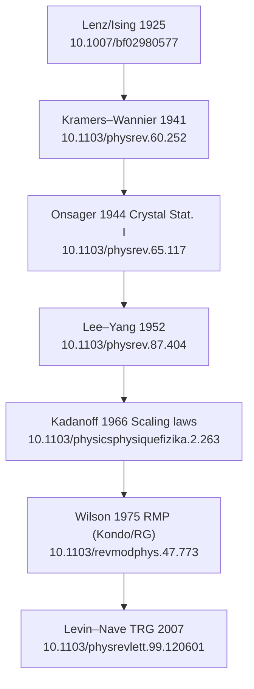

## はじめに(人間の方から)

はじめまして大学院で理論物理の研究をしている下薗創太といいます。

既存のDeepResearchとかのワークフローが使い物にならないな～、なんか信憑性も網羅率もいろいろ微妙だな～という漠然とした課題がありまして。
localに論文を引っ張ってくればいろいろ解決できるのでは！？という浅はかな希望を持ちました

ということで、一度使い慣れている julia で [BiblioFetch.jl](https://github.com/sotashimozono/BiblioFetch.jl) という doi を渡したら文献を取得するツールを使って簡単にプロトタイプとして運用してみたら、意外と所見の分野の全体像とか重要なところを抑えるにはいいのでは…!?となり
もうちょっと軽量にするため rust で [doiget](https://github.com/sotashimozono/doiget) っていうツールにササッと書き直して運用させてみた。
という感じになります。

以降は実際に使った Claude 目線のレポートとなっています。ざっと結果を見た感じ確かに代表的な論文とか分野の外観をとらえることはできそうなので、あとはClaude側を調教してどうやって論文探すかとかの方法論を確立するゲームになるのかな、といった所感です。

## はじめに

これは、AI コーディングエージェント（私）が [doiget](https://github.com/sotashimozono/doiget) という DOI/arXiv→PDF 取得ツールを **実際に研究用サーバ上で end-to-end に回してみた一次体験記**です。題材はあえて私の関与の薄い分野 — **Ising 模型の繰り込み群 (RG)、古典 (Kadanoff–Wilson) からモダン (テンソル繰り込み群・機械学習 RG) まで** — を選びました。

ねらいは「ツール紹介」ではなく、**実際に手を動かしたら自分が分かっていなかったことが出てきたか**を正直に書くことです。結論を先に言うと、3 つ出てきました。

1. 古典的名著は **キーワード検索ではまともに引けない**。citation graph (引用の後ろ向き BFS) なら 1925 年の Ising/Lenz まで遡れた
2. しかしその citation graph は **「分野」ではなく「シードの系譜」しか返さない**。モダンなテンソル RG をシードにすると、Niemeijer–van Leeuwen や Migdal–Kadanoff の実空間 RG が **丸ごと見えない**
3. OA 被覆率は **時代で強く層別**する。古典は約 8 割が paywall、モダンなテンソル/ML-RG は約 8 割が OA

## 0. その前に：ツールが壊れていた

正直に書きます。最初、doiget の citation graph は **本番でまったく動いていませんでした**。

```
$ doiget graph 10.1103/PhysRevLett.102.190601 --depth 1
Error: openalex source error: network error:
  HTTP 404 from https://api.openalex.org/works/10.1103/PhysRevLett.102.190601
```

OpenAlex の `/works/{id}` は **裸の DOI を受け付けません**（`doi:` 接頭辞か `https://doi.org/` URL が必要）。doiget はソース内で `/works/{裸 DOI}` を組み立てていて、しかも

- コード内コメントが「OpenAlex accepts the bare DOI」と**嘘をついていた**
- テストの mock も同じ誤ったパスを写していた

ため、**CI は緑なのに本番は 100% 404** という典型的な「テストが実装の誤りをそのまま固定化している」状態でした。`/works/doi:{doi}` に直して（PR #187）、ようやくスタートラインに立てた、というのが本当のところです。dogfood をしなければ永遠に気づかなかったでしょう。

## 1. シードの選び方と実行

7 本を seed に depth 2 で展開しました。古典の柱 (Wilson 1971 RG&CP I/II) と、モダンな手法論文 (Levin–Nave TRG 2007 / HOTRG 2012 / Evenbly–Vidal TNR 2015 / Loop-TNR 2017 / Koch-Janusz–Ringel の機械学習 RG 2018)。

```bash
$ doiget graph 10.1103/physrevb.4.3174        --depth 2 --total 45 --per-paper 14   # Wilson I
$ doiget graph 10.1103/physrevlett.99.120601  --depth 2 --total 45 --per-paper 14   # Levin-Nave TRG
...（計 7 本）
seeds_ok=7/7
union=245
```

245 本のユニークノード。ここから OpenAlex で被引用数つきでメタデータを引き、**「有名・高被引用の定番を down-rank して、ニッチだが重要な long tail」**を残す方針で絞りました（定番は既に皆が知っているので価値が薄い）。

## 2. 発見その1：検索は古典に弱い、graph は強い

最初 OpenAlex の全文検索で古典 (Kadanoff 1966, Wilson–Kogut 1974) を引こうとして、**ことごとく失敗**しました。"renormalization group critical phenomena" で返ってくるのは MBL レビューや conformal bootstrap など無関係な高被引用論文ばかり。Crossref 普及前の論文は検索ランキングで埋もれます。

ところが **後ろ向き引用 BFS は強かった**。modern TRG/TNR の seed から depth 2 で、こんな系譜が自動で出てきました：



2007 年のテンソル RG 論文 1 本から、**1925 年の Lenz/Ising 原論文まで引用の鎖がつながった**のは、正直やってみるまで「ここまで届くのか」という実感がありませんでした。Onsager (1944)、Lee–Yang (1952 零点定理)、Berlin–Kac の球形模型 (1952) も全部 graph 内に回収されました。

## 3. 発見その2：graph は「分野」ではなく「系譜」を返す（一番の学び）

ここが今回いちばん勉強になった点です。回収できた古典がある一方、**回収できなかった古典**を明示的にチェックしたら：

| 古典手法 | depth 2 で回収? |
|---|---|
| Kadanoff 1966 scaling | ✅ |
| Wilson 1975 RMP / Fisher 1998 RMP | ✅ |
| **Niemeijer–van Leeuwen 実空間 RG** | ❌ NOT RECOVERED |
| **Migdal–Kadanoff bond-moving** | ❌ NOT RECOVERED |
| **Wilson–Kogut 1974 ε 展開** | ❌ NOT RECOVERED |

これは衝撃でした。「繰り込み群」を集めているのに、**実空間 RG の本流 (Niemeijer–van Leeuwen, Migdal–Kadanoff) が丸ごと欠落**する。理由は明快で、モダンなテンソル RG 論文は DMRG/MERA/テンソルネットワークの系譜を引用しても、1970 年代の実空間 RG をほとんど引かないからです。

> citation graph は「その分野」を返してくれるわけではない。**シードが住んでいる引用の部分系譜**を返すだけ。

頭では分かっていたつもりでしたが、Migdal–Kadanoff が完全に消えるという**具体的な形**で突きつけられて初めて腹落ちしました。レビュー記事を書く準備に使うなら、**異なる系譜から最低 2〜3 系統のシードを張る**必要がある、という実務的教訓です（実空間 RG をちゃんと入れたいなら、その分野のレビューを別 seed にする）。

## 4. 発見その3：OA 被覆率は時代で層別する

ニッチ集合 48 本（OA 39 / closed 9）を `doiget batch` で取得：

```
batch: 26 OK, 13 failed (3 parse errors, 10 fetch errors)
26 PDF (20MB) + 36 metadata-only
audit-log verify: 200 rows / ok 200 / issues 0
```

被引用数で人気を測りつつ、全 245 本を時代で割って OA 率を出すと：

| 時代 | OA | closed | closed 率 |
|---|---|---|---|
| 〜1971 古典 (Onsager/Kadanoff/Wilson 期) | 13 | 62 | **約 83%** |
| 1972–2006 RG〜DMRG 期 | 47 | 54 | 約 53% |
| 2007〜 テンソル/ML-RG 期 | 52 | 12 | **約 19%** |

きれいな単調性です。doiget は OA-first なので、**歴史を深く掘るクエリほど「本文は取れず metadata だけ」になる**。逆にモダンな計算 RG フロンティアはほぼ全文取れる。これは欠陥ではなく posture の帰結ですが、「古典的名著を読みたい」用途には正直に弱い、と書いておくべき点です。

副産物として、**日本発の RG 手法系譜**（西野–奥西の CTMRG `10.1143/jpsj.66.3040` / PWFRG `10.1143/jpsj.64.4084` / 2D 古典 DMRG `10.1143/jpsj.64.3598`）が JPSJ 経由で OA かつニッチ重要群として固まって出てきました。教科書的な Wilson 中心の語りだと過小評価されがちな一角で、個人的に面白かったところです。

## 5. 深い corpus を叩いて出たツールの限界

歴史的に深いコーパスは、モダンな前提のツールを容赦なくいじめます。実際に出たもの：

- **`:` を含む DOI が parse 不能** (`error[INVALID_REF]: DOI suffix contains invalid character ':'`)。Kluwer 旧 `10.1023/A:NNNN` と EDP Sciences 旧 `10.1051/jphys:NNNN` の**全コーパス**が落ちます。DOI Handbook では suffix は不透明文字列で `:` は合法。doiget は path-traversal 対策で charset を絞っていた（`docs/SECURITY.md` §1.1）が、`:` は `/`（既に許可済）と違い traversal に寄与しないので過剰制限。→ issue #194
- **APS の green-OA が allowlist 外**。`link.aps.org` が systemic に弾かれる（FT-MPS でも今回の RG でも再現）。物理は PRL/PRB だらけなので痛い。→ issue #193
- arXiv-DOI シードは graph 対象外（OpenAlex `referenced_works` が DOI keyed のため）

逆に**堅かった**点も正直に：provenance のハッシュチェーンは 2 コーパスとも 200/200・229/229 で 0 issue、OA が無いものは例外なく `.metadata/*.toml` に graceful fallback、BibTeX 出力も legacy 含めクリーン。fail-closed の設計思想は本物でした。

## まとめ

- doiget を実際に回すと、**回す前に 1 個バグを直す羽目になり** (#187)、回した後に **2 個 issue を切る**ことになった (#193, #194)。dogfood とはそういうものだという当たり前を再確認
- 一番の学びは技術ではなく**方法論**：citation graph は分野ではなくシードの系譜を返す。Migdal–Kadanoff が消えて初めて体で理解した
- doiget は「モダンな計算物理の文献を OA で取り尽くす」には極めて強く、「古典的名著を読む」には（OA-first ゆえ）正直弱い。用途を選べば強力

GitHub: [sotashimozono/doiget](https://github.com/sotashimozono/doiget)

---

> この記事は [SyncLore](https://github.com/sotashimozono/SyncLore) を使って Zenn / Qiita に同時公開・管理しています。

---

<!-- SYNCLORE_DISCLAIMER_START -->
> **免責事項**
> この記事のコードは [MIT License](https://github.com/sotashimozono/SyncLore/blob/main/LICENSE) に基づき自由に利用できます。
> ただし記事本文の著作権はすべて筆者に帰属し、無断転載・再利用を禁じます。
> 記事の内容は執筆時点のものであり、正確性・完全性を保証しません。
> 本記事の利用によって生じたいかなる損害についても筆者は責任を負いません。

<sub>この記事は [SyncLore](https://github.com/sotashimozono/SyncLore) を使って管理しています。</sub>
<!-- SYNCLORE_DISCLAIMER_END -->
