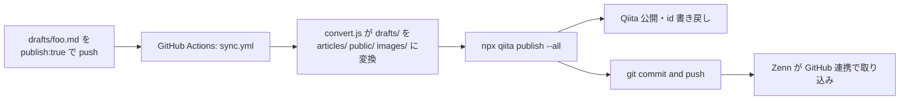

## What's SyncLore?

[SyncLore](https://github.com/sotashimozono/SyncLore) は **GitHub リポジトリを Single Source of Truth** として、`drafts/` に書いた Markdown を **Zenn と Qiita の両方に自動公開** する一元管理リポジトリです。

作成した記事 `drafts/foo.md` に `publish: true` というプロパティを割り当て、 `main` branch に push するだけで、両プラットフォームに同じ内容の記事が反映されます。

## 動機

技術記事を Qiita と Zenn の両方に投稿したい場合、コピペで二重管理するとこんな問題が起きます。

- 後から修正したときに片方だけ古いまま
- 画像のパス指定が両者で違う
- フロントマターの仕様が違う (`emoji`, `type` は Zenn のみ、`tags` は Qiita で形式が異なる)
- 公開・非公開フラグの名前が違う (`published` vs `private`)

...それと単に両方に記事を同時に公開するのがめんどくさい。

SyncLore は **「Markdown は `drafts/` に 1 つだけ書く」** で済ませるためのツールです。

## アーキテクチャ

```text
SyncLore/
├── drafts/          ← ★ ここに Markdown を書く (SSoT)
│   ├── my-article.md
│   └── images/my-article/
├── articles/        ← Zenn-CLI 用 (CI が自動生成)
├── public/          ← Qiita-CLI 用 (CI が自動生成・id 保管)
├── images/          ← Zenn が参照する画像 (CI が自動生成)
└── src/convert.js   ← drafts/ を両形式に冪等変換
```

`articles/`・`public/`・`images/` は CI が生成するので、人間は `drafts/` だけを編集します。

## ワークフロー



GitHub Actions で **convert → qiita publish → commit & push** の順に atomic に実行します。Qiita publish が失敗した場合は commit 自体が走らないため、「Zenn だけ更新されて Qiita は古いまま」のようなズレは発生しません。

## 使い方

### 1. 記事を書く

`drafts/template.md` をコピーして、新しいファイル名（スラグ）を決めます。

```markdown
---
title: "記事タイトル"
emoji: "✨"
type: "tech"
topics: ["julia", "oss"]
publish: false
---

## はじめに

...
```

### 2. 公開

`publish: true` に変更して main へプッシュ。

```bash
git add drafts/my-article.md
git commit -m "Add: my-article"
git push
```

GitHub Actions が走り、Zenn と Qiita の両方に同じ内容が公開されます。

### 3. 編集・修正

`drafts/my-article.md` を編集してまた push するだけ。記事 ID は `public/<slug>.md` の `id` フィールドに保管されているため、Qiita 側でも同じ記事が更新されます。免責事項は HTML コメントマーカで囲まれているので、再変換しても重複しません。

### 4. 記事の取り下げ

`publish: false` に戻して push すると:

- Zenn: `published: false` (draft 扱い)
- Qiita: `private: true` (限定共有 = 非公開)

両方とも公開状態から外れます。

### 5. 画像を使う

`drafts/images/my-article/figure1.png` に置けば、CI が `images/my-article/` にコピーします。記事内では Zenn 形式で参照します。

```markdown

```

## 仕組み

### Zenn 側

Zenn は GitHub 連携機能で、リポジトリの `articles/*.md` を直接見に来ます。`main` への push が webhook で通知され、Zenn 側のフィードに自動反映されます。SyncLore は `articles/` を Zenn-CLI の規約どおりに生成するだけで、Zenn への投稿 API を直接叩く必要はありません。

### Qiita 側

Qiita 公式の [qiita-cli](https://github.com/increments/qiita-cli) を使い、`npx qiita publish --all` で `public/*.md` の内容を Qiita API 経由で投稿・更新します。新規記事のときは Qiita が割り当てた記事 id を `public/<slug>.md` に書き戻すので、次回以降は同じ id で update されます。

### convert.js の役割

`drafts/<slug>.md` を読み、Zenn と Qiita それぞれの規約に合わせて `articles/<slug>.md` と `public/<slug>.md` を冪等に再生成します。

- フロントマターのキー名や形式の差を吸収 (`topics` 配列 ↔ `tags: [{name}]` 形式)
- 公開フラグを翻訳 (`publish:true` → Zenn `published:true` / Qiita `private:false`)
- 画像ディレクトリを `drafts/images/<slug>/` から `images/<slug>/` にコピー
- 末尾に免責事項を HTML コメントマーカで囲んで自動追加（重複防止のため毎回 strip → re-add）
- Qiita の記事 id は既存の `public/<slug>.md` から読み戻して引き継ぎ

## 初期セットアップ

1. [SyncLore](https://github.com/sotashimozono/SyncLore) を fork または clone
2. `npm install`
3. GitHub Secrets に `QIITA_TOKEN` を登録（Settings → Secrets and variables → Actions）
4. [Zenn のデプロイ設定](https://zenn.dev/dashboard/deploys) でリポジトリを連携
5. リポジトリを Public に設定（GitHub Actions の無料枠を使うため）

## おわりに

`drafts/` 配下に Markdown を 1 つ書くだけで、Zenn と Qiita 両方への投稿・更新・取り下げを GitHub のワークフローに乗せられます。

リポジトリはこちら: [sotashimozono/SyncLore](https://github.com/sotashimozono/SyncLore)

なおこの記事自体も SyncLore で書かれていて、両プラットフォームに同時投稿されています。

---

<!-- SYNCLORE_DISCLAIMER_START -->
> **免責事項**
> この記事のコードは [MIT License](https://github.com/sotashimozono/SyncLore/blob/main/LICENSE) に基づき自由に利用できます。
> ただし記事本文の著作権はすべて筆者に帰属し、無断転載・再利用を禁じます。
> 記事の内容は執筆時点のものであり、正確性・完全性を保証しません。
> 本記事の利用によって生じたいかなる損害についても筆者は責任を負いません。
<!-- SYNCLORE_DISCLAIMER_END -->
